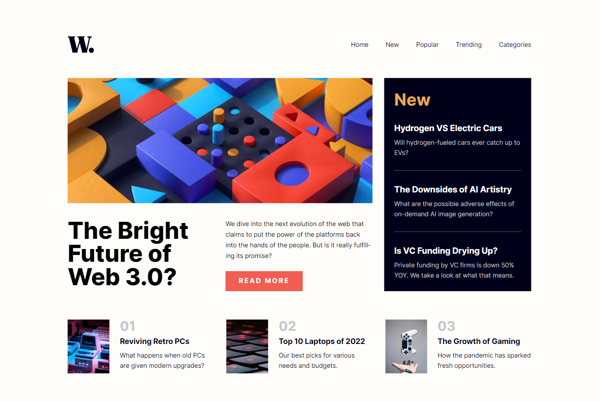

# Simple News Homepage

<div align="center"></div>

Design, assets, and requirements provided by [FrontEndMentors](https://www.frontendmentor.io/challenges/news-homepage-H6SWTa1MFl).

The requirement of the project is to create a simple news homepage that is responsive and matches the design provided in the Figma file.

[Live Demo]()

## Table of Contents

- [TechStack Used](#techstack-used)
- [Running the application](#running-the-application)
- [Development Process](#development-process)
  - [NavBar](#navbar)

## TechStack Used

This is a [Next.js](https://nextjs.org/) project bootstrapped with [`create-next-app`](https://github.com/vercel/next.js/tree/canary/packages/create-next-app). This project is not built using the experimental `app` directory feature. Libraries used in this project include:

- [React](https://reactjs.org/), a library for building user interfaces
- [TypeScript](https://www.typescriptlang.org/), a statically typed language that builds on JavaScript
- [SCSS](https://sass-lang.com/), a CSS preprocessor

The project is linted with [ESLINT](https://eslint.org/) and [Prettier](https://prettier.io/). Please see the [.eslintrc config file for a list of all rules used](./.eslintrc).

## Running the application

To run the application locally on your device, please follow these steps:

1. Clone the repository
2. Navigate to the project directory
3. Install the dependencies with `npm install`
4. Run the application with `npm run dev`

The application will be running on [http://localhost:3000](http://localhost:3000).

## Development Process

I already have expereience using Next JS, so I just wanted to brush up on my skills and get more confortable with the framework. I exclusively use [CSS Modules](https://github.com/css-modules/css-modules) and [Styled-Components](https://styled-components.com/) for my projects, but this time I wanted to revisit SCSS and see if I would prefer using that or just stick to CSS Modules and Styled-Components. As the CSS spec continues to improve with new features and browser support, I wanted to see if SCSS was still worth using in the current environment.

Developing this project did not pose many major challenges, but some of the issues I ran into are listed below.

### NavBar

When initally setting the struture of the application, I wanted to just create one `<nav>` element on the page, and just style the nav bar/menu with SCSS. For example, on smaller devices the "hamburger" menu would appear, and user's would be able to toggle between opening the closing the menu with scrolling disabled as well. On larger devcies, the style of the navbar was changed so that the menu would be displayed horizontally.

```typescript
<nav id="nav-menu" aria-hidden={!showMenu} className={styles.navMobile}>
          <button
            aria-label="click button to close the nav menu"
            aria-controls="nav-menu"
            onClick={() => {
              const nextContainer = document.getElementById(
                '__next'
              ) as HTMLElement;
              document.body.classList.remove('mobileNavActive');
              nextContainer.classList.remove('mobileNavActive');
              setShowMenu(false);
            }}
            className={styles.closeMenuButton}
          >
            <Image
              src="/images/icon-menu-close.svg"
              width={30}
              height={30}
              alt="close menu icon"
            />
          </button>

          <ul className={styles.navLinks}>
            <li>
              <a href="home">Home</a>
            </li>
        ...
```

One issue that arose was when switching from a tablet/desktop view to mobile, the animation for showing the mobile menu would play. This occured due to the useEffect hook which was changing the `showMenu` that toggled the navbar for the mobile view. Since the state change caused the transitoin to fire, the transition would occur on the media query the state change occured on. I also wanted to add some accessibility to this application as well which is why I am using `aria-hidden`. I believed it would be best to use that value to set the styles of the nav menu instead of toggling between a class.

```scss
.navMobile {
  position: fixed;
  right: 0;
  top: 0;
  height: 100%;
  width: 68vw;
  background-color: $background-color;
  display: flex;
  flex-direction: column;
  padding: 1.6em 1.3em 0 1.4em;
  transition: transform 0.25s linear;
  z-index: 2;

  &[aria-hidden='true'] {
    transform: translateX(100%);
  }

  @media screen and (min-width: 768px) {
    display: none;
  }
}
```

After multiple attempts I decided it would be best to just create two different nav elements, one for mobile and one for desktop, and ensure the correct element is displayed properly.

```typescript
<nav id="nav-menu" aria-hidden={!showMenu} className={styles.navMobile}>
          <button
            aria-label="click button to close the nav menu"
            aria-controls="nav-menu"
            onClick={() => {
              const nextContainer = document.getElementById(
                '__next'
              ) as HTMLElement;
              document.body.classList.remove('mobileNavActive');
              nextContainer.classList.remove('mobileNavActive');
              setShowMenu(false);
            }}
            className={styles.closeMenuButton}
          >
            <Image
              src="/images/icon-menu-close.svg"
              width={30}
              height={30}
              alt="close menu icon"
            />
          </button>

          <ul className={styles.navLinks}>
            <li>
              <a href="home">Home</a>
            </li>
            <li>
              <a href="new">New</a>
            </li>
            <li>
              <a href="popular">Popular</a>
            </li>
            <li>
              <a href="trending">Trending</a>
            </li>
            <li>
              <a href="categories">Categories</a>
            </li>
          </ul>
        </nav>

        <nav id="nav-desktop" className={styles.navDesktop}>
          <ul className={styles.navLinks}>
            <li>
              <a href="home">Home</a>
            </li>
            <li>
              <a href="new">New</a>
            </li>
            <li>
              <a href="popular">Popular</a>
            </li>
            <li>
              <a href="trending">Trending</a>
            </li>
            <li>
              <a href="categories">Categories</a>
            </li>
          </ul>
        </nav>
```

## Conclusion

Overall this applicaiton allowed me to get a quick refresh on some tools I have been using for a while. It was nice to ge ta refresh on SCSS, it is a great tool to use despite the recent CSS advances, so i'll keep it in my toolbox for future projects.

If you have any feedback please feel free to contact me at [jorgemendozaiidev@gmail.com](mailto:jorgemendozaiidev@gmail.com)
